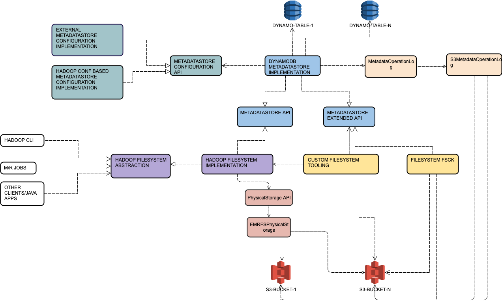

# S3-FileSystem

# Hadoop Core Requirements

The Hadoop FileSystem contract in terms of atomicity/consistency/concurrency is detailed [here](https://hadoop.apache.org/docs/stable/hadoop-project-dist/hadoop-common/filesystem/introduction.html#Core_Expectations_of_a_Hadoop_Compatible_FileSystem).

## Atomicity

Hadoop original requirements:
```
There are some operations that MUST be atomic. This is because they are often used to implement locking/exclusive access between processes in a cluster.
1. Creating a file. If the overwrite parameter is false, the check and creation MUST be atomic.
2. Deleting a file.
3. Renaming a file.
4. Renaming a directory.
5. Creating a single directory with mkdir().
Recursive directory deletion MAY be atomic. Although HDFS offers atomic recursive directory deletion, none of the other Hadoop FileSystems offer such a guarantee (including local FileSystems).
Most other operations come with no requirements or guarantees of atomicity.
```
**We support atomic rename of files (with the caveat that the metastore and operation log can drift).**

**Atomic creation of file with overwrite parameter set to false *can* be implemented (currently it is not).**

## Consistency

Hadoop original requirements:
```
1. Create. Once the close() operation on an output stream writing a newly created file has completed, in-cluster operations querying the file metadata and contents MUST immediately see the file and its data.

2. Update. Once the close() operation on an output stream writing a newly created file has completed, in-cluster operations querying the file metadata and contents MUST immediately see the new data.

3. Delete. once a delete() operation on a path other than “/” has completed successfully, it MUST NOT be visible or accessible. Specifically, listStatus(), open() ,rename() and append() operations MUST fail.

4. Delete then create. When a file is deleted then a new file of the same name created, the new file MUST be immediately visible and its contents accessible via the FileSystem APIs.

5. Rename. After a rename() has completed, operations against the new path MUST succeed; attempts to access the data against the old path MUST fail.

6. The consistency semantics inside of the cluster MUST be the same as outside of the cluster. All clients querying a file that is not being actively manipulated MUST see the same metadata and data irrespective of their location.
```
**We do not support the `append()` operation. Apart from this we are inline with the Hadoop consistency requirements.**

## Concurrency

Hadoop original requirements:
```
There are no guarantees of isolated access to data: if one client is interacting with a remote file and another client changes that file, the changes may or may not be visible.
```
**We are inline with Hadoop concurrency requirements.**

# High Level Design


We will refer to the paths as viewed by clients of the FileSystem as **_logical paths_**.
We will refer the S3 keys under which we store the client data as **_physical paths_**.


## MetadataStoreConfiguration API and Implementation

This layer is responsible for providing configuration information that the concrete MetadataStore implementation requires.
It is context aware: for example a metadata heavy client(like a M/R job driver or `LoadIncrementalHFiles`) might have different configuration requirements from a data heavy client (a map task). 
The context is specified using a JAVA system property `fs.s3k.metastore.context.id`.
We currently have one implementation:
 - A Hadoop `Configuration` based one. All the config data will reside in the Hadoop configuration and will be passed by the client directly.

The configuration API will be K/V style for the most part, but more specific interfaces for concrete implementations of `MetadataStore` **_may_** exist.


## MetadataStore API and Implementation

This layer is responsible for:
- Maintaining the association between the logical paths and physical paths.
- Exposing an API for manipulating these associations: basic CRUD operations + recursive delete/rename operations on directory logical paths.
- Exposing an extended API for operations that are not achievable through the Hadoop `FileSystem` contract. For example:
   * An operation of recursive listing that can be implemented efficiently depending on MetaStore internals.
   * An operation for listing all logical paths for a given bucket, regardless of parent<->child relationship validity  (think of `fsck` type scenarios).


### DynamodDB MetadataStore Implementation.

This is the main implementation of the MetadataStore API and the core part of the FileSystem as an ensemble.

We store all the data for a given logical path in a single DynamoDB `Item`.

Key structure for a path `p`:
```
{
 	hash_key: parent(p)-suffix(child_name(p))
 	sort_key: child_name(p)
 }
```
The hash key is composed from the path's parent to which we apply a suffix. The suffix is chosen from a predefined set of suffixes `suffixes=[s0..sN-1]` this way: `s=suffixes[hash(child_name(path)) % N]`.

**_NOTE_**: 
 - The number of suffixes impacts directly the throughput you can achieve for operations within a single directory. Increasing the number of suffixes theoretically increases throughput but requires data migration. 

In the DynamoDB we also store the following attributes:
```
{
 	is_dir: boolean // directory flag
 	len: long // object length in bytes, 0 for directories
 	ctime: long	// creation time as UNIX epoch in seconds, NOTE: this is the local time of the client that creates the file/folder
 	phy_path: String // S3 key where the data is stored (the physical path)
    physcommitted: boolean // wether the data was committed to physical storage (i.e. close() called and successfull on the OutputStream)
    id: UUID // the unique id of the object. For directories it is not very important, however see `File Object versioning` for files
    ver int // the version of the object
 }
```

To simplify the implementation we have decided that a single instance of the DynamoDB metadata store will work with a single 
table and a FileSystem instance will work with a single bucket. Writing to multiple buckets from the same process will imply multiple FileSystem instances. Moving data between multiple buckets will require copying of the data and will not be a metadata operation.


### File Object Versioning.

Whenever a new dir/file is created a unique ID is assigned to it. It is also considered to be at version 1.

Whenever and object is mutated (i.e. renamed, physical updated etc.) its version is incremented and the ID remains the same.
At the time of the mutation the updated version and id are checked against DynamoDB(via a ConditionWrite) to ensure consistency.

The version and the unique ID are also persisted by the `MetadataOperationLog` and used by FSCK to determine if the state of the system is consistent.


## MetadataOperationLog

This layer is the equivalent of HDFS's FSEditLog.
It stores all metadata operations related to **_file_** objects.
It is used directly by MetadataStore implementations. 

The following sequence of actions is always followed when logging file operations.
 - All operations **must** be first logged to the operation log and marked as pending.
   * If this fails, the whole operation fails. 
 - The operation is performed in the MetadataStore.
   * If this fails, the whole operation fails. An attempt must be made to rollback the operation log.
 - The operation log entry is marked as committed.
   * If this fails, the operation is **still considered succesfull**.
  

## Hadoop FileSystem Implementation

At this layer we are implementing the Hadoop `FileSystem` contract.
This layer is responsible for:
 - Implementing all Hadoop semantics as outlined [here](https://hadoop.apache.org/docs/r3.1.0/api/org/apache/hadoop/fs/FileSystem.html). For example semantics like: `mkdir()` has `mkdir -p` POSIX semantics, `create()` does not require entire directory structure to exist beforehand etc 
- Ensuring we use a dispersed key space for all S3 buckets.


## PhysicalStorage API

This layer is a simple CRD(create/read/delete no update because files in s3-fs are immutable) API over a blob storage.
The main implementation is backed by EMRFS.
S3 eventual consistency is handled by this layer.


## FileSystem Tooling and FSCK

This layer implements:
 - A CLI similar to `hadoop fs` but with some operations implemented more efficiently. It relies on the MetadataStore Extended API.
 - A FSCK CLI tool that must be able to repair an inconsistent FileSystem.
   * If the `MetadataStore` is completely lost, it will reconstruct it from the operation log.
   * If data is still valid in the `MetadataStore` it will amend the operation log to reflect that state.
   
Details on [usage](../src/main/java/com/adobe/s3fs/shell/commands/fsck/FsckReadme.md).

